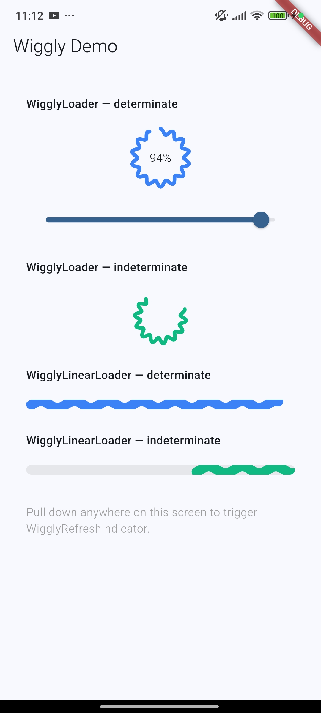
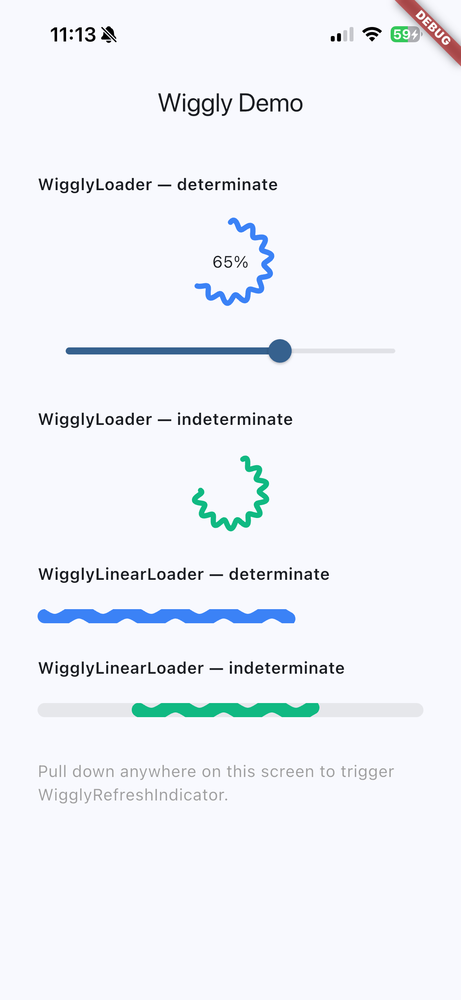

# wiggly_loaders

A collection of smooth, customizable wiggly loading indicators for Flutter. Package ships three widgets: circular progress, linear progress, and pull-to-refresh.

## Preview

Demo video:

- [giphy_wiggly.mp4](assets/readme/giphy_wiggly.mp4)

Screenshots:

| Android                                    | iOS                                 |
|--------------------------------------------|-------------------------------------|
|  |  |

## Why use it

- Same visual language across loader, progress bar, and refresh UI
- Determinate and indeterminate modes
- Pure Flutter `CustomPainter`, no third-party runtime deps
- Tunable wave count, amplitude, colors, timing, and sizing
- Example app included

## Included widgets

| Widget                   | Use case                                | Modes                      |
|--------------------------|-----------------------------------------|----------------------------|
| `WigglyLoader`           | Circular progress/loading state         | determinate, indeterminate |
| `WigglyLinearLoader`     | Inline/file/network progress bar        | determinate, indeterminate |
| `WigglyRefreshIndicator` | Pull-to-refresh wrapper for scrollables | pull progress, refreshing  |

## Installation

Add to `pubspec.yaml`:

```yaml
dependencies:
  wiggly_loaders: ^0.3.0
```

Import:

```dart
import 'package:wiggly_loaders/wiggly_loaders.dart';
```

## Quick start

### WigglyLoader

```dart
// Known progress
WigglyLoader(progress: 0.76)

// Unknown progress
WigglyLoader.indeterminate()

// Custom
WigglyLoader(
  progress: _downloadProgress,
  size: 80,
  strokeWidth: 5,
  progressColor: Colors.teal,
  trackColor: Colors.teal.shade50,
  wiggleCount: 12,
  wiggleAmplitude: 4.0,
  child: Text('76%', style: TextStyle(fontSize: 14)),
)
```

### WigglyLinearLoader

```dart
// Known progress
WigglyLinearLoader(progress: 0.6)

// Unknown progress
WigglyLinearLoader.indeterminate()

// Custom
WigglyLinearLoader(
  progress: _uploadProgress,
  height: 8,
  wiggleCount: 6,
  progressColor: Colors.deepPurple,
  trackColor: Colors.deepPurple.shade50,
  borderRadius: 4,
)
```

### WigglyRefreshIndicator

```dart
// Basic
WigglyRefreshIndicator(
  onRefresh: () async {
    await fetchLatestData();
  },
  child: ListView.builder(
    itemCount: items.length,
    itemBuilder: (context, index) => ListTile(title: Text(items[index])),
  ),
)

// Custom
WigglyRefreshIndicator(
  onRefresh: _handleRefresh,
  progressColor: Colors.orange,
  trackColor: Colors.orange.shade50,
  backgroundColor: Colors.white,
  size: 56,
  displacement: 64,
  child: myScrollableWidget,
)
```

## Theme extension

Set package-wide defaults through `ThemeData.extensions`:

```dart
MaterialApp(
  theme: ThemeData(
    extensions: const [
      WigglyLoadersThemeData(
        loaderProgressColor: Color(0xFF0EA5E9),
        linearProgressColor: Color(0xFF0EA5E9),
        refreshProgressColor: Color(0xFF0EA5E9),
      ),
    ],
  ),
  home: const MyPage(),
)
```

## Example app

Run demo:

```bash
cd example
flutter run
```

Run mobile target:

```bash
cd example
flutter run -d android
flutter run -d ios
```

## API guide

### WigglyLoader and WigglyRefreshIndicator

| Parameter         | Default             | Description                                      |
|-------------------|---------------------|--------------------------------------------------|
| `progress`        | required            | Progress from `0.0` to `1.0` in determinate mode |
| `size`            | `72.0` / `52.0`     | Loader diameter                                  |
| `strokeWidth`     | `4.5` / `4.0`       | Arc and track stroke width                       |
| `wiggleCount`     | `14`                | Number of wiggle cycles around arc               |
| `wiggleAmplitude` | `3.5`               | Wiggle size in logical pixels                    |
| `progressColor`   | blue                | Foreground arc color                             |
| `trackColor`      | light gray          | Background ring color                            |
| `wiggleDuration`  | `1200ms`            | Wiggle animation speed                           |
| `rotateDuration`  | `1600ms` / `1500ms` | Spin speed                                       |
| `arcSpan`         | `0.7`               | Fraction of circle used by indeterminate arc     |
| `willAnimate`     | `true`              | Intro animation when widget appears              |
| `semanticsLabel`  | auto                | Accessibility label                              |
| `semanticsValue`  | auto                | Accessibility value                              |

### WigglyLoader only

| Parameter | Default | Description               |
|-----------|---------|---------------------------|
| `child`   | `null`  | Widget rendered in center |

### WigglyLinearLoader

| Parameter         | Default    | Description                                      |
|-------------------|------------|--------------------------------------------------|
| `progress`        | required   | Progress from `0.0` to `1.0` in determinate mode |
| `height`          | `6.0`      | Track height                                     |
| `wiggleCount`     | `8`        | Wiggle cycles across full width                  |
| `wiggleAmplitude` | `2.5`      | Vertical wiggle size                             |
| `progressColor`   | blue       | Foreground bar color                             |
| `trackColor`      | light gray | Background track color                           |
| `wiggleDuration`  | `1000ms`   | Wiggle animation speed                           |
| `slideDuration`   | `1400ms`   | Indeterminate slide speed                        |
| `segmentFraction` | `0.45`     | Width of sliding segment                         |
| `borderRadius`    | `99.0`     | Track corner radius                              |
| `willAnimate`     | `true`     | Intro animation when widget appears              |
| `semanticsLabel`  | auto       | Accessibility label                              |
| `semanticsValue`  | auto       | Accessibility value                              |

### WigglyRefreshIndicator only

| Parameter         | Default  | Description                         |
|-------------------|----------|-------------------------------------|
| `onRefresh`       | required | Async callback fired on refresh     |
| `child`           | required | Wrapped scrollable                  |
| `displacement`    | `50.0`   | Resting top offset while refreshing |
| `triggerDistance` | `80.0`   | Drag distance needed to trigger     |
| `maxDragDistance` | `120.0`  | Max tracked pull distance           |
| `notificationPredicate` | default | Notification filter for nested scrolls |
| `backgroundColor` | white    | Badge background                    |
| `elevation`       | `2.0`    | Badge shadow elevation              |
| `semanticsLabel`  | `Pull to refresh` | Accessibility label         |

## Behavior notes

- Determinate constructors assert `progress` stays inside `0.0..1.0`
- With `willAnimate: true`, loaders animate in from `0` each time mounted
- `WigglyLinearLoader` keeps wave phase anchored to full width so pattern does not jump while segment slides
- `WigglyRefreshIndicator` switches from pull progress to indeterminate spin until `onRefresh` completes
- Duration props update correctly on rebuilds
- When `MediaQuery.disableAnimations` is true, motion automatically softens (slower + lower amplitude)

## Customization tips

- Lower `wiggleAmplitude` for subtle motion
- Raise `wiggleCount` for denser wave texture
- Increase `strokeWidth` or `height` for bolder loaders
- Use muted `trackColor` for stronger foreground contrast
- Put text or icons inside `WigglyLoader.child` for compact status UI

## Package status

- Flutter SDK: `>=3.10.0`
- Dart SDK: `>=3.0.0 <4.0.0`
- License: MIT
- Example app included

## Publish checklist

- Run `flutter analyze`
- Run `flutter test`
- Run `flutter pub publish --dry-run`

## License

MIT
