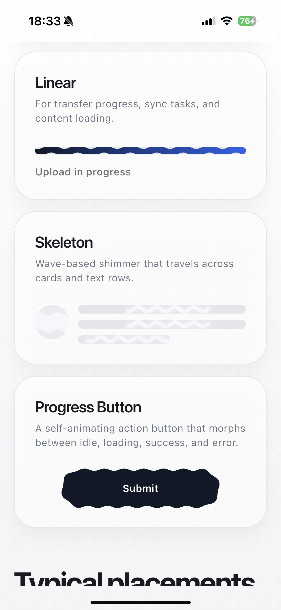
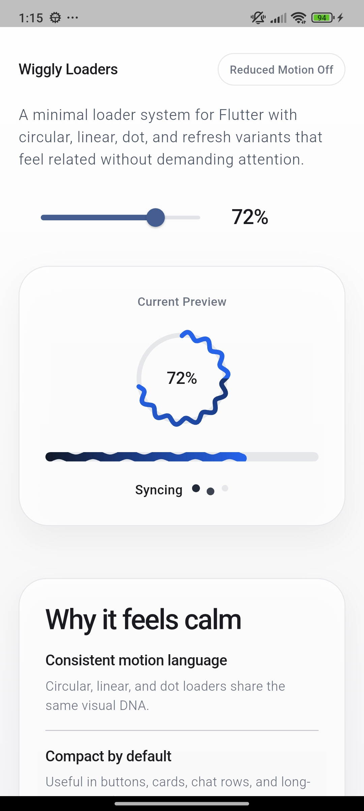
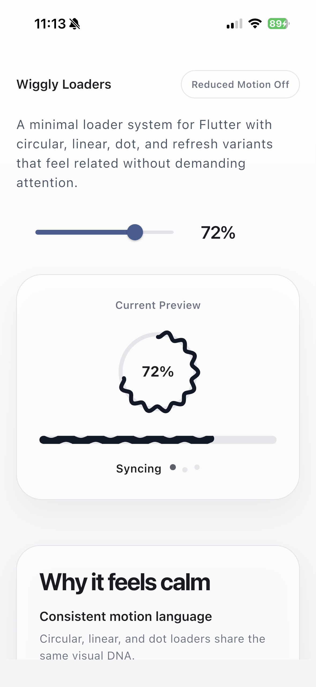
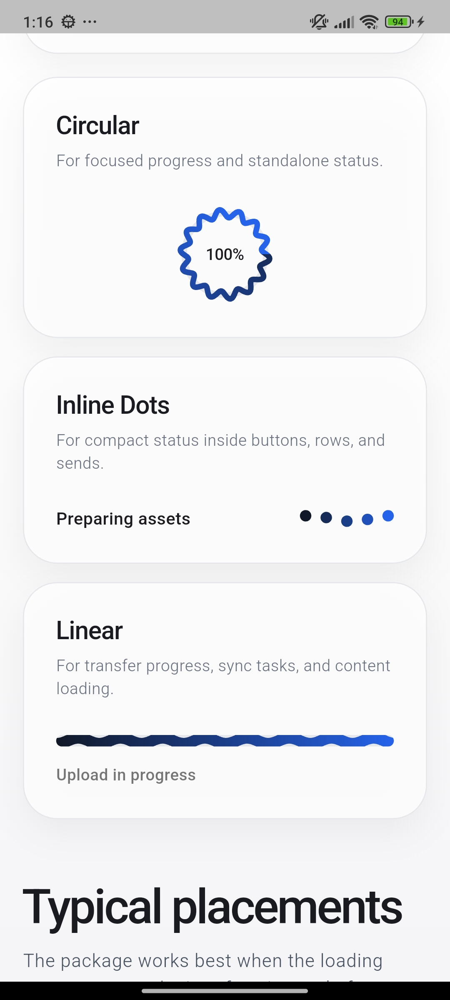
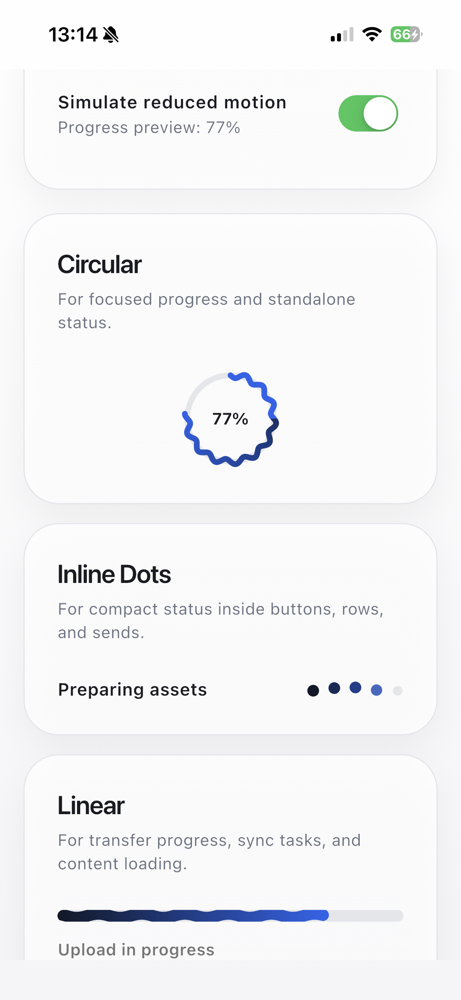

# wiggly_loaders

A collection of smooth, customizable wiggly loading indicators for Flutter. Package ships circular, linear, compact dot, and pull-to-refresh variants, including optional gradient progress fills.

## Preview

![Wiggly Loaders preview] https://www.youtube.com/shorts/xEHiK6YdJvQ

`WigglySkeletonLoader` and `WigglyProgressButton` from the example app:



Screenshots:

| Android                                       | iOS                                    |
|-----------------------------------------------|----------------------------------------|
|  |  |
|  |  |

## Why use it

- Same visual language across loader, progress bar, and refresh UI
- Determinate and indeterminate modes
- Optional color interpolation across arcs, bars, and dots
- Optional `WigglyController` for external playback and progress control
- Global `debugWigglyLoaders` overlay for tuning wave math visually
- Pure Flutter `CustomPainter`, no third-party runtime deps
- Tunable wave count, amplitude, colors, timing, and sizing
- Example app included

## Included widgets

| Widget                   | Use case                                              | Modes                            |
|--------------------------|-------------------------------------------------------|----------------------------------|
| `WigglyLoader`           | Circular progress/loading state                       | determinate, indeterminate       |
| `WigglyLinearLoader`     | Inline/file/network progress bar                      | determinate, indeterminate       |
| `WigglyDotsLoader`       | Compact inline/button/chat status                     | determinate, indeterminate       |
| `WigglyRefreshIndicator` | Pull-to-refresh wrapper for scrollables               | pull progress, refreshing        |
| `WigglySkeletonLoader`   | Skeleton placeholders with traveling wiggly highlight | block, text lines, card          |
| `WigglyProgressButton`   | Self-animating action button                          | idle → loading → success / error |

## Installation

Add to `pubspec.yaml`:

```yaml
dependencies:
  wiggly_loaders: ^0.8.0
```

Import:

```dart
import 'package:wiggly_loaders/wiggly_loaders.dart';
```

## Quick start

### WigglyLoader

```dart
// Known progress
WigglyLoader(progress: 0.76)

// Unknown progress
WigglyLoader.indeterminate()

// Custom
WigglyLoader(
  progress: _downloadProgress,
  size: 80,
  strokeWidth: 5,
  progressColor: Colors.teal,
  progressEndColor: Colors.cyan,
  trackColor: Colors.teal.shade50,
  wiggleCount: 12,
  wiggleAmplitude: 4.0,
  child: Text('76%', style: TextStyle(fontSize: 14)),
)
```

### WigglyLinearLoader

```dart
// Known progress
WigglyLinearLoader(progress: 0.6)

// Unknown progress
WigglyLinearLoader.indeterminate()

// Custom
WigglyLinearLoader(
  progress: _uploadProgress,
  height: 8,
  wiggleCount: 6,
  progressColor: Colors.deepPurple,
  progressEndColor: Colors.pinkAccent,
  trackColor: Colors.deepPurple.shade50,
  borderRadius: 4,
)
```

### WigglyDotsLoader

```dart
// Known progress
WigglyDotsLoader(progress: 0.6)

// Unknown progress
WigglyDotsLoader.indeterminate()

// Custom
WigglyDotsLoader(
  progress: _sendProgress,
  dotCount: 5,
  dotSize: 10,
  spacing: 8,
  wiggleAmplitude: 3,
  progressColor: Colors.teal,
  progressEndColor: Colors.cyan,
  trackColor: Colors.teal.shade50,
)
```

### WigglySkeletonLoader

A shimmering placeholder where the highlight is a sinusoidal wave that **travels** horizontally across the surface — instead of the flat gradient shimmer most packages ship.

```dart
// Single block
WigglySkeletonLoader(width: 200, height: 16)

// Multi-line text placeholder
WigglySkeletonLoader.text(
  lines: 4,
  lineHeight: 12,
  lastLineFraction: 0.5,
)

// Card placeholder (avatar + lines)
WigglySkeletonLoader.card(
  avatarSize: 48,
  lines: 3,
)

// Tuned
WigglySkeletonLoader(
  width: double.infinity,
  height: 20,
  borderRadius: 10,
  baseColor: Colors.grey.shade200,
  highlightColor: Colors.white,
  waveAmplitude: 4,
  waveLength: 30,
  bandWidth: 64,
  duration: const Duration(milliseconds: 1400),
)
```

### WigglyProgressButton

A button that morphs through `idle → loading → success / error` while the whole shape wiggles continuously.

```dart
WigglyButtonState _state = WigglyButtonState.idle;

WigglyProgressButton(
  state: _state,
  onPressed: () async {
    setState(() => _state = WigglyButtonState.loading);
    try {
      await submit();
      setState(() => _state = WigglyButtonState.success);
    } catch (_) {
      setState(() => _state = WigglyButtonState.error);
    }
  },
  onComplete: () => debugPrint('reached success'),
  child: const Text('Submit'),
)
```

### WigglyRefreshIndicator

```dart
// Basic
WigglyRefreshIndicator(
  onRefresh: () async {
    await fetchLatestData();
  },
  child: ListView.builder(
    itemCount: items.length,
    itemBuilder: (context, index) => ListTile(title: Text(items[index])),
  ),
)

// Custom
WigglyRefreshIndicator(
  onRefresh: _handleRefresh,
  progressColor: Colors.orange,
  progressEndColor: Colors.deepOrange,
  trackColor: Colors.orange.shade50,
  backgroundColor: Colors.white,
  size: 56,
  displacement: 64,
  child: myScrollableWidget,
)
```

### WigglyController

Use one controller per loader when you need app-driven playback:

```dart
final controller = WigglyController()
  ..addStatusListener((status) {
    if (status == WigglyControllerStatus.completed) {
      debugPrint('loader done');
    }
  });

WigglyLoader.indeterminate(
  controller: controller,
);

controller.pause();
controller.resume();
controller.jumpTo(0.72);
controller.clearProgress();
```

### debugWigglyLoaders

Flip the global flag during integration to render guide lines and sample points:

```dart
debugWigglyLoaders = true;
```

## Theme extension

Set package-wide defaults through `ThemeData.extensions`:

```dart
MaterialApp(
  theme: ThemeData(
    extensions: const [
      WigglyLoadersThemeData(
        progressColor: Color(0xFF0EA5E9),
        trackColor: Color(0xFFE0F2FE),
        sizeScale: 1.15,
        strokeWidthScale: 1.1,
        speedFactor: 1.2,
        ease: Curves.easeOutCubic,
      ),
    ],
  ),
  home: const MyPage(),
)
```

## Example app

Run demo:

```bash
cd example
flutter run
```

Run mobile target:

```bash
cd example
flutter run -d android
flutter run -d ios
```

## API guide

### WigglyLoader and WigglyRefreshIndicator

| Parameter          | Default                 | Description                                                        |
|--------------------|-------------------------|--------------------------------------------------------------------|
| `progress`         | required                | Progress from `0.0` to `1.0` in determinate mode                   |
| `size`             | `72.0` / `52.0`         | Loader diameter                                                    |
| `strokeWidth`      | `4.5` / `4.0`           | Arc and track stroke width                                         |
| `wiggleCount`      | `14`                    | Number of wiggle cycles around arc                                 |
| `wiggleAmplitude`  | `3.5`                   | Wiggle size in logical pixels                                      |
| `progressColor`    | blue                    | Foreground arc color                                               |
| `progressEndColor` | same as `progressColor` | Optional gradient end color for the arc                            |
| `trackColor`       | light gray              | Background ring color                                              |
| `wiggleDuration`   | `1200ms`                | Wiggle animation speed                                             |
| `rotateDuration`   | `1600ms` / `1500ms`     | Spin speed                                                         |
| `arcSpan`          | `0.7`                   | Fraction of circle used by indeterminate arc                       |
| `willAnimate`      | `true`                  | Intro animation when widget appears                                |
| `semanticsLabel`   | auto                    | Accessibility label                                                |
| `semanticsValue`   | auto                    | Accessibility value                                                |
| `controller`       | `null`                  | External handle for pause, resume, progress override, and status   |
### WigglyLoader only

| Parameter          | Default                 | Description                                                        |
|--------------------|-------------------------|--------------------------------------------------------------------|
| `child`            | `null`                  | Widget rendered in center                                          |
| `onComplete`       | `null`                  | Callback fired after burst animation when `progress` reaches `1.0` |
| `completeDuration` | `450ms`                 | Duration of the burst animation                                    |

### WigglyLinearLoader

| Parameter          | Default                 | Description                                                        |
|--------------------|-------------------------|--------------------------------------------------------------------|
| `progress`         | required                | Progress from `0.0` to `1.0` in determinate mode                   |
| `height`           | `6.0`                   | Track height                                                       |
| `wiggleCount`      | `8`                     | Wiggle cycles across full width                                    |
| `wiggleAmplitude`  | `2.5`                   | Vertical wiggle size                                               |
| `progressColor`    | blue                    | Foreground bar color                                               |
| `progressEndColor` | same as `progressColor` | Optional gradient end color for the filled segment                 |
| `trackColor`       | light gray              | Background track color                                             |
| `wiggleDuration`   | `1000ms`                | Wiggle animation speed                                             |
| `slideDuration`    | `1400ms`                | Indeterminate slide speed                                          |
| `segmentFraction`  | `0.45`                  | Width of sliding segment                                           |
| `borderRadius`     | `99.0`                  | Track corner radius                                                |
| `willAnimate`      | `true`                  | Intro animation when widget appears                                |
| `semanticsLabel`   | auto                    | Accessibility label                                                |
| `semanticsValue`   | auto                    | Accessibility value                                                |
| `controller`       | `null`                  | External handle for pause, resume, progress override, and status   |
| `onComplete`       | `null`                  | Callback fired after burst animation when `progress` reaches `1.0` |
| `completeDuration` | `450ms`                 | Duration of the burst animation                                    |

### WigglyDotsLoader

| Parameter          | Default                 | Description                                                        |
|--------------------|-------------------------|--------------------------------------------------------------------|
| `progress`         | required                | Progress from `0.0` to `1.0` in determinate mode                   |
| `dotCount`         | `3`                     | Number of dots in the row                                          |
| `dotSize`          | `8.0`                   | Diameter of each dot                                               |
| `spacing`          | `6.0`                   | Gap between dots                                                   |
| `wiggleAmplitude`  | `2.5`                   | Vertical wiggle size                                               |
| `progressColor`    | blue                    | Active dot color                                                   |
| `progressEndColor` | same as `progressColor` | Optional gradient end color across active dots                     |
| `trackColor`       | light gray              | Inactive dot color                                                 |
| `duration`         | `900ms`                 | Wiggle/travel speed                                                |
| `willAnimate`      | `true`                  | Intro animation when widget appears                                |
| `semanticsLabel`   | auto                    | Accessibility label                                                |
| `semanticsValue`   | auto                    | Accessibility value                                                |
| `controller`       | `null`                  | External handle for pause, resume, progress override, and status   |
| `onComplete`       | `null`                  | Callback fired after burst animation when `progress` reaches `1.0` |
| `completeDuration` | `450ms`                 | Duration of the burst animation                                    |

### WigglyRefreshIndicator only

| Parameter               | Default                 | Description                            |
|-------------------------|-------------------------|----------------------------------------|
| `onRefresh`             | required                | Async callback fired on refresh        |
| `child`                 | required                | Wrapped scrollable                     |
| `displacement`          | `50.0`                  | Resting top offset while refreshing    |
| `triggerDistance`       | `80.0`                  | Drag distance needed to trigger        |
| `maxDragDistance`       | `120.0`                 | Max tracked pull distance              |
| `notificationPredicate` | default                 | Notification filter for nested scrolls |
| `backgroundColor`       | white                   | Badge background                       |
| `progressEndColor`      | same as `progressColor` | Optional gradient end color            |
| `elevation`             | `2.0`                   | Badge shadow elevation                 |
| `semanticsLabel`        | `Pull to refresh`       | Accessibility label                    |

## Behavior notes

- Determinate constructors assert `progress` stays inside `0.0..1.0`
- With `willAnimate: true`, loaders animate in from `0` each time mounted
- `WigglyLoader` and `WigglyRefreshIndicator` can interpolate arc color from `progressColor` to `progressEndColor`
- `WigglyLinearLoader` can interpolate color across the filled bar or sliding segment
- `WigglyDotsLoader` can interpolate active dot color across the row
- `WigglyLinearLoader` keeps wave phase anchored to full width so pattern does not jump while segment slides
- `WigglyDotsLoader` uses the same wiggly phase in both modes, with determinate fill or a traveling highlighted cluster
- `WigglyRefreshIndicator` switches from pull progress to indeterminate spin until `onRefresh` completes
- Duration props update correctly on rebuilds
- When `MediaQuery.disableAnimations` is true, motion automatically softens (slower + lower amplitude)

## Customization tips

- Lower `wiggleAmplitude` for subtle motion
- Raise `wiggleCount` for denser wave texture
- Increase `strokeWidth` or `height` for bolder loaders
- Use `WigglyDotsLoader` when space is tight: buttons, chat sends, inline status rows
- Use muted `trackColor` for stronger foreground contrast
- Put text or icons inside `WigglyLoader.child` for compact status UI

## Cookbook

### Upload/download progress card

When to use: file transfer UI with explicit percent.

```dart
Card(
  child: Padding(
    padding: const EdgeInsets.all(16),
    child: Column(
      crossAxisAlignment: CrossAxisAlignment.start,
      children: [
        const Text('Uploading report.pdf'),
        const SizedBox(height: 12),
        WigglyLinearLoader(progress: progress, height: 10),
        const SizedBox(height: 8),
        Text('${(progress * 100).round()}%'),
      ],
    ),
  ),
)
```

Key knobs: `height`, `wiggleAmplitude`, `trackColor`.

### Infinite list pagination footer

When to use: loading next page at bottom of long lists.

```dart
if (isLoadingMore)
  const Padding(
    padding: EdgeInsets.symmetric(vertical: 16),
    child: Center(
      child: WigglyDotsLoader.indeterminate(
        dotCount: 4,
        semanticsLabel: 'Loading more items',
      ),
    ),
  )
```

Key knobs: `dotCount`, `dotSize`, `duration`.

### Retry/failure to loading transition

When to use: retry button swaps to in-place progress without layout jump.

```dart
AnimatedSwitcher(
  duration: const Duration(milliseconds: 180),
  child: isRetrying
      ? const WigglyDotsLoader.indeterminate(
          key: ValueKey('retrying'),
          dotCount: 3,
        )
      : FilledButton(
          key: const ValueKey('retry'),
          onPressed: retry,
          child: const Text('Retry'),
        ),
)
```

Key knobs: `willAnimate`, `spacing`.

### Button loading state pattern

When to use: async submit/send button with compact inline feedback.

```dart
FilledButton(
  onPressed: isSending ? null : sendMessage,
  child: isSending
      ? const WigglyDotsLoader.indeterminate(
          dotSize: 8,
          spacing: 6,
          semanticsLabel: 'Sending',
        )
      : const Text('Send'),
)
```

Key knobs: `dotSize`, `spacing`, `progressColor`.

### Pull-to-refresh with nested scroll handling

When to use: tabs, nested scroll views, or any screen where only top-level pulls should refresh.

```dart
WigglyRefreshIndicator(
  onRefresh: reload,
  notificationPredicate: (notification) => notification.depth == 0,
  child: NestedScrollView(
    headerSliverBuilder: (_, __) => [const SliverAppBar(title: Text('Inbox'))],
    body: ListView.builder(
      itemCount: items.length,
      itemBuilder: (context, index) => ListTile(title: Text(items[index])),
    ),
  ),
)
```

Key knobs: `notificationPredicate`, `triggerDistance`, `maxDragDistance`.

### Completion burst with onComplete callback

When to use: show a success indicator or navigate away once progress finishes.

```dart
WigglyLoader(
  progress: _uploadProgress,
  onComplete: () {
    setState(() => _showSuccess = true);
  },
)
```

Works the same on `WigglyLinearLoader` and `WigglyDotsLoader`:

```dart
WigglyLinearLoader(
  progress: _progress,
  onComplete: _navigateToNextStep,
)
```

Key knobs: `completeDuration` (burst length), `wiggleAmplitude` (baseline amplitude the burst scales from).

### Themed loaders via `WigglyLoadersThemeData`

When to use: one visual language across all loaders without repeating colors,
size, stroke, and motion settings.

```dart
MaterialApp(
  theme: ThemeData(
    extensions: const [
      WigglyLoadersThemeData(
        progressColor: Color(0xFF0F766E),
        trackColor: Color(0xFFCCFBF1),
        backgroundColor: Colors.white,
        sizeScale: 1.1,
        strokeWidthScale: 1.15,
        speedFactor: 0.9,
        ease: Curves.easeInOutCubic,
      ),
    ],
  ),
  home: const DashboardScreen(),
)
```

Key knobs: `progressColor`, `trackColor`, `backgroundColor`, `sizeScale`,
`strokeWidthScale`, `speedFactor`, `ease`.

Per-loader overrides still work:
`loaderProgressColor`, `linearProgressColor`, `dotsProgressColor`,
`refreshProgressColor`.

## Package status

- Flutter SDK: `>=3.10.0`
- Dart SDK: `>=3.0.0 <4.0.0`
- License: MIT
- Example app included

## Publish checklist

- Run `flutter analyze`
- Run `flutter test`
- Run `flutter pub publish --dry-run`

## License

MIT
